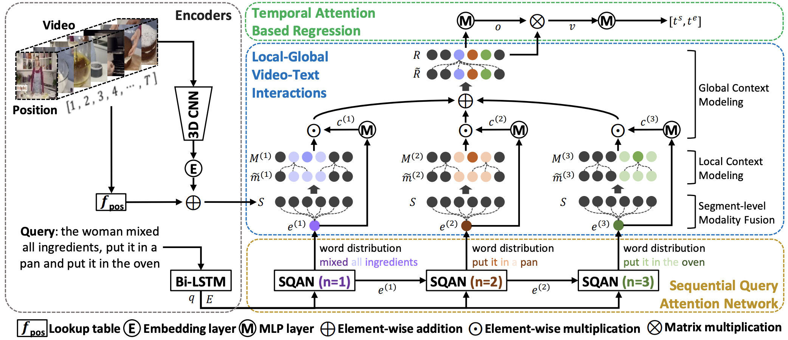

Local-Global Video-Text Interactions for Temporal Grounding
=====
PyTorch implementation of Local-Global Interaction (LGI) network for temporal grounding given a text query.

[Local-Global Video-Text Interactions for Temporal Grounding](http://arxiv.org/abs/2004.07514)

[Jonghwan Mun](http://cvlab.postech.ac.kr/~jonghwan/), [Minsu Cho](http://cvlab.postech.ac.kr/~mcho/), [Bohyung Han](https://cv.snu.ac.kr/index.php/bhhan/)


Overall architecture of our algorithm (LGI).
Given a video and a text query, we encode them to obtain segment-level visual features, word-level and sentence-level textual features.
We extract a set of semantic phrase features from the query using the Sequential Query Attention Network (SQAN).
Then, we obtain semantics-aware segment features based on the extracted phrase features via local-global video-text interactions.
Finally, we directly predict the time interval from the summarized video features using the temporal attention.
We train the model using the regression loss and two additional attention-related losses.

#### 1. Dependencies
This repository is implemented based on [PyTorch](http://pytorch.org/) with Anaconda.</br>
Refer to [Setting environment with anaconda](anaconda_environment.md) or use **Docker** (choco1916/envs:temporal_grounding).

#### 2. Prepare data
Running `scripts/prepare_data.sh` will download all data including annotations, video features (I3D for Charades-STA, C3D for ActivityNet Captions), pre-processed annotation information.
```bash
bash scripts/prepare_data.sh
```
- **Troubleshooting**
  - If fail to download `LGI_data.tar.gz`, then uncomment the following lines in `scripts/prepare_data.sh` and run the lines to download files individually.
  ```
  ### Download data for activitynet dataset
  wget http://cvlab.postech.ac.kr/~jonghwan/data/LGI/anet_ann_data.tar.gz # annotation + (preprocessed ones)
  mv LGI data
  rm anet_ann_data.tar.gz
  # please download the C3D features from http://activity-net.org/challenges/2016/download.html
  # move the C3D feature file into data/LGI/feats/

  ### Download data for charades dataset
  wget http://cvlab.postech.ac.kr/research/LGI/charades_data.tar.gz
  tar zxvf charades_data.tar.gz
  mv charades data
  rm charades_data.tar.gz
  ```

#### 3. Evaluating pre-trained models
* Using **anaconda** environment
```bash
conda activate tg
bash scripts/download_pretrained_models.sh
# Evaluate LGI model trained from ActivityNet Captions Dataset
CUDA_VISIBLE_DEVICES=0 python -m src.experiment.eval \
                     --config pretrained_models/anet_LGI/config.yml \
                     --checkpoint pretrained_models/anet_LGI/model.pkl \
                     --method tgn_lgi \
                     --dataset anet
# Evaluate LGI model trained from Charades-STA Dataset
CUDA_VISIBLE_DEVICES=0 python -m src.experiment.eval \
                     --config pretrained_models/charades_LGI/config.yml \
                     --checkpoint pretrained_models/charades_LGI/model.pkl \
                     --method tgn_lgi \
                     --dataset charades
```
The pre-trained models will report following scores.
While re-implementing this code, the reproduced numbers are slightly different.
(reproduced vs. paper-version at R@0.5: 41.65 vs. 41.51 and 59.17 vs. 59.46 in ActivityNet Captions and Charades-STA, respectively)

Dataset              | R@0.3 | R@0.5 | R@0.7 | mIoU
-------------------- | ------| ------| ------| ------
ActivityNet Captions | 58.48 | 41.65 | 24.10 | 41.48
Charades-STA         | 72.18 | 59.17 | 35.32 | 50.93


#### 4. Training models from scratch
This code will load all the data (~30GB for ActivityNet Captions and ~3GB for Charades-STA) into RAM for the fast training, if you want to disable this behavior, set `in_memory` in a config file (`config.yaml`) as `FALSE`.
* Using **anaconda** environment
```bash
conda activate tg
# LGI model for ActivityNet Captions dataset
bash scripts/train_model.sh LGI tgn_lgi anet 0 4 0
# LGI model for Charades-STA dataset
bash scripts/train_model.sh LGI tgn_lgi charades 0 4 0
```

* Using **Docker**
```bash
# LGI model for ActivityNet Captions dataset
bash scripts/run_docker.sh "bash scripts/train_model.sh LGI tgn_lgi anet 0 4 0" "gpu0"
# LGI model for Charades-STA dataset
bash scripts/run_docker.sh "bash scripts/train_model.sh LGI tgn_lgi charades 0 4 0" "gpu0"
```

#### 5. Visualization
For the visualization, we need [`moviepy`](https://zulko.github.io/moviepy/) package as well as raw videos.</br>
```
# Path to directory for raw videos
ActivityNet Captions: data/anet/raw_videos/validation/
Charades-STA: data/charades/raw_videos/
```
Refer to [visualization.ipynb](visualization.ipynb)


#### 6. Citation
If you use this code in a publication, please cite our paper.

```
@inproceedings{mun2020LGI,
    title     = "{Local-Global Video-Text Interactions for Temporal Grounding}",
    author    = {Mun, Jonghwan and Cho, Minsu and and Han, Bohyung},
    booktitle = {CVPR},
    year      = {2020}
}
```
